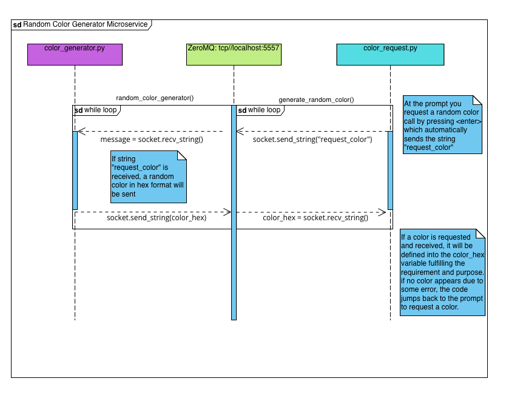

REQUESTING DATA:

    CLI commands: # In seperate terminals

    python3 color_request.py
    python3 color_generator.py

    Both files are running in for loops indefinitely.
    You don't interact with "color_generator.py", only
    with "color_request.py".

    In "color_request.py" you will be prompted with:
    "Press <enter> to generate random color or type 'exit' to quit: "
    If you press "enter" you will receive the random number,
    "exit" will terminate the program.

    The only data you will send occurs when you press "enter".
    You will send the string "request_color" which is the string
    the other file requires to send the random color.

RECEIVING DATA:
    
    The only thing you receive from the microservice is a random string
    of a hexademical formatted color from a range: ("#0", "#FFFFFF").
    For debugging purposes, when this data is received the file will 
    print out: "Received color: #FFFFFF"

    NOTE: "color_request.py" is used as a file to test the generator,
          this file is not needed. Only "color_generator.py" is the 
          microservice required by the assignment.

    
SAMPLE CALL:

    User/your/current/directory % python3 color_request.py

    Press <enter> to generate random color or type 'exit' to quit: 
    Received color: #018272
    Press <enter> to generate random color or type 'exit' to quit: exit

    User/your/current/directory %

UML Diagram:

    
    